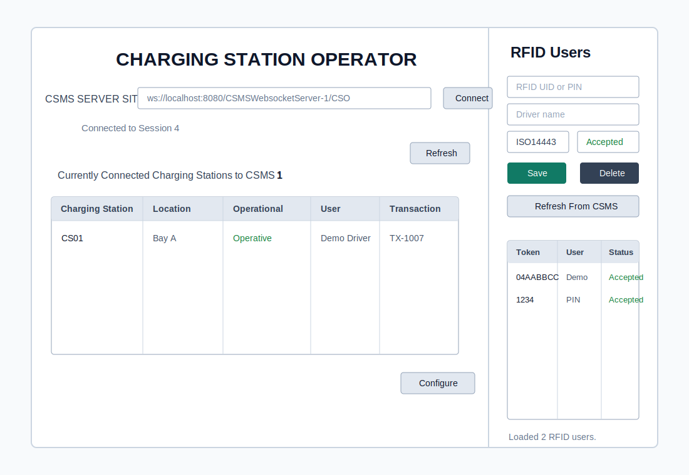
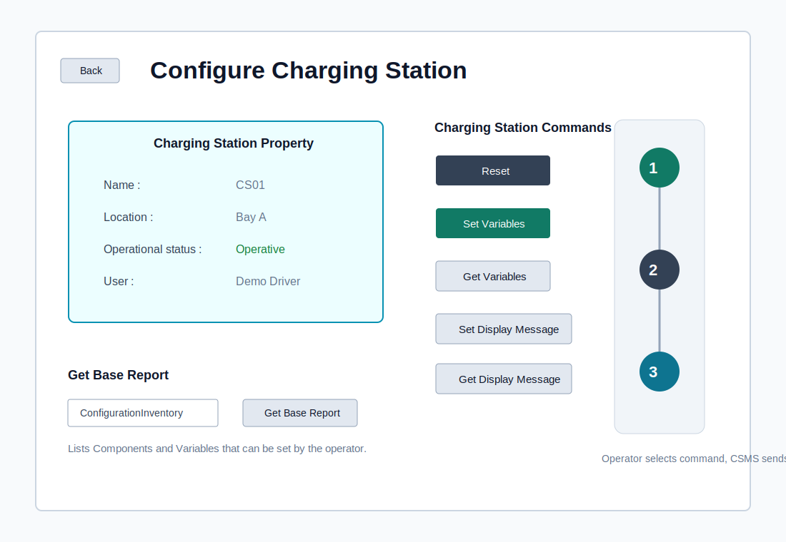
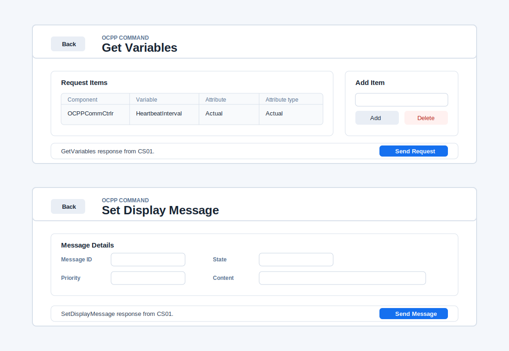

# OCPPbasedCSO

JavaFX operator tool for basic Charging Station Operator tasks.

The useful path today is RFID user management:

1. Start/deploy `ocppCSMS`.
2. Open this CSO app and connect to:

```text
ws://localhost:8080/CSMSWebsocketServer-1/CSO
```

3. Add RFID UIDs or PINs in the RFID Users panel.
4. `OCPPcharger` sends normal OCPP `Authorize` messages to `ocppCSMS`.
5. `ocppCSMS` accepts or rejects authorization based on the CSO-managed token list.

## UI Preview

Main CSO dashboard with CSMS connection, connected charger table, and RFID user management:



Charging station configuration page:



Command pages after selecting an OCPP operation:



Current UI areas:

| Area | Purpose |
| --- | --- |
| CSMS connection | Connects the CSO app to `ocppCSMS` as `/CSO`. |
| Charging station table | Shows known charger identity, location, status, active user, and transaction id. |
| RFID Users panel | Adds, deletes, and refreshes RFID/PIN authorization records stored in CSMS. |
| Configure page | Starts charger management actions such as variables and display messages. |

## Admin Messages

The CSO app uses a small JSON admin protocol with `ocppCSMS`; the charger still uses OCPP-J.

```json
{"type":"RfidUsersList"}
{"type":"RfidUserUpsert","idToken":"04AABBCC","tokenType":"ISO14443","userName":"Demo Driver","status":"Accepted"}
{"type":"RfidUserDelete","idToken":"04AABBCC"}
```

The token concepts mirror the OCPP 2.1 authorization schema: `AuthorizeRequest.idToken` contains an `idToken` plus a `type`, and the CSMS replies with `idTokenInfo.status`.

## OCPP Charger Controls

The Configure page now wires the basic OCPP operator actions to `ocppCSMS`, which forwards them to charger `CS01`:

| CSO Screen | OCPP Action |
| --- | --- |
| Set Variables | `SetVariables` |
| Get Variables | `GetVariables` |
| Set Display Message | `SetDisplayMessage` |
| Get Display Message | `GetDisplayMessages`, followed by `NotifyDisplayMessages` data from the charger when messages exist. |

The CSO transport message is intentionally small:

```json
{"type":"ForwardOcppCall","chargingStationId":"CS01","action":"SetVariables","payload":{"setVariableData":[]}}
```

The payload is sent to the charger as the OCPP request payload. The operation screens show the CSMS forwarding result and the charger response.

## Build

```bash
./gradlew compileJava
```

Run:

```bash
./gradlew run
```
